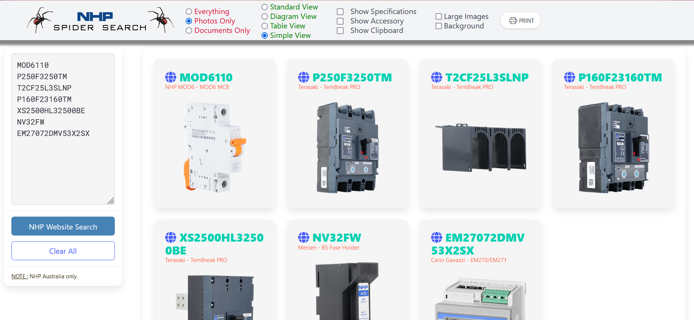
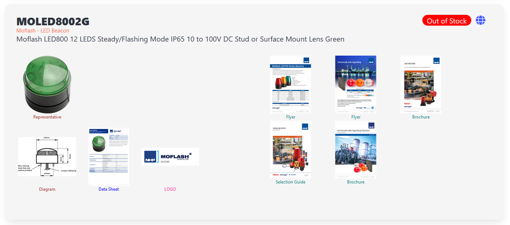
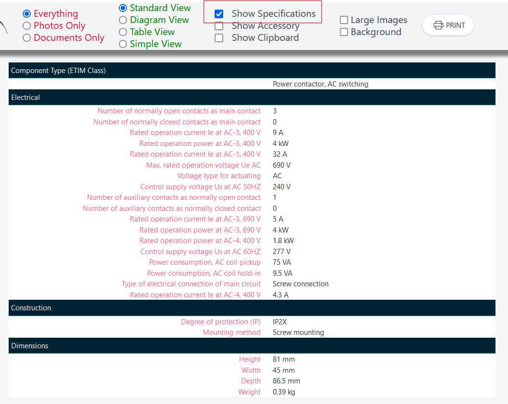
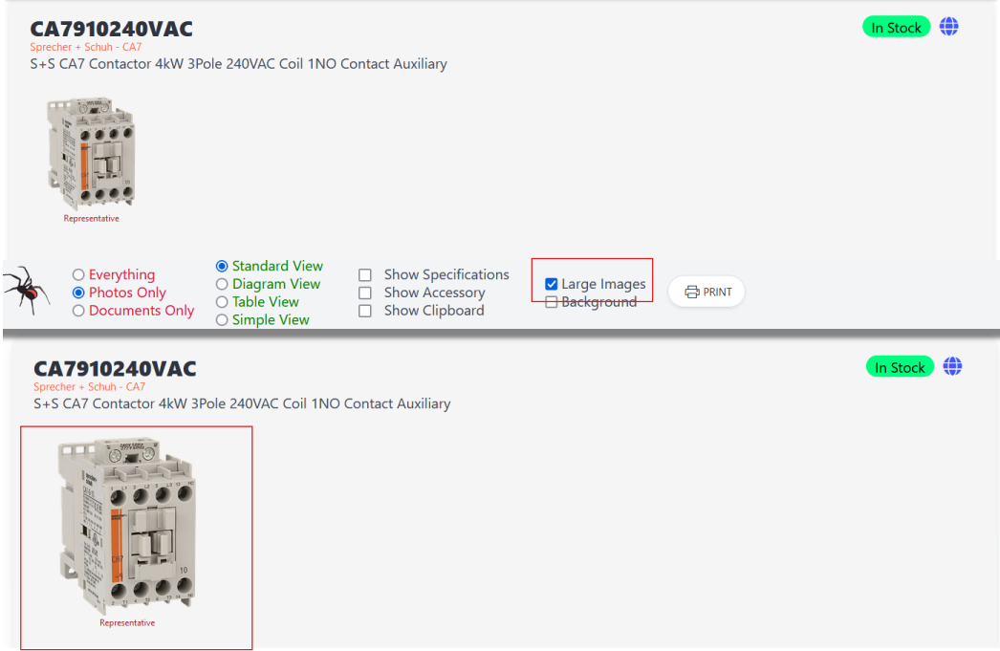
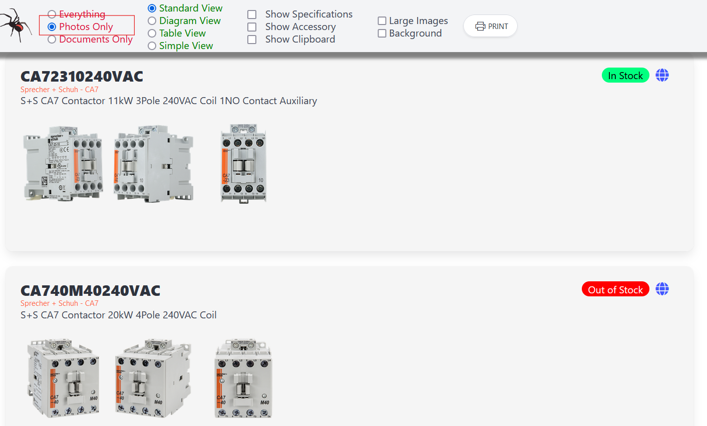
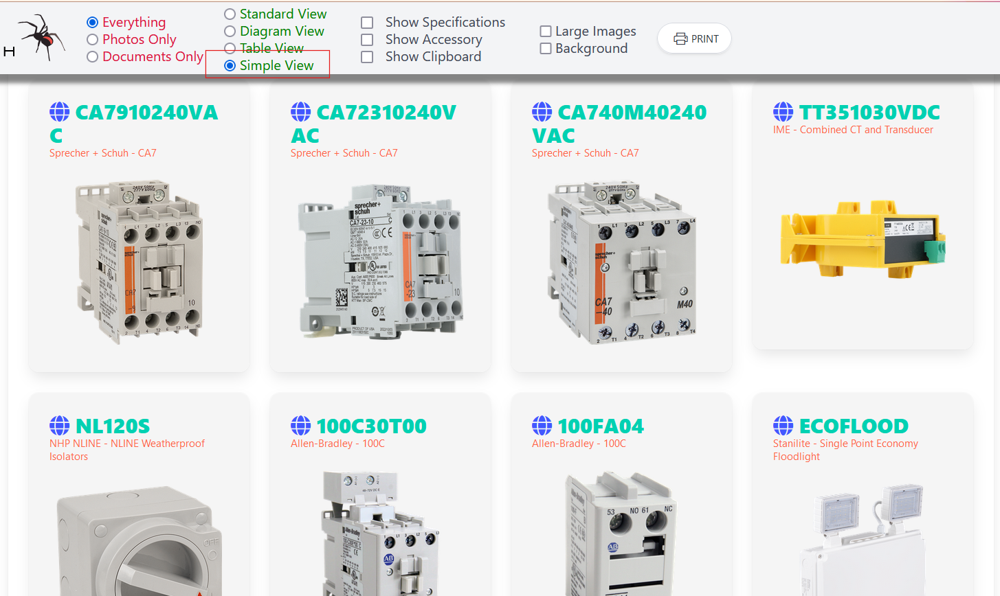

# NHP-Bulk-Search
Bulk search product _item numbers_ of the Australian [NHP Electrical Engineering Products](https://www.nhp.com.au) website.

~~Version : 2.35~~
**Version : 2.50**

Quickly find a product items:
* Specifications
* Photos
* Diagrams
* Technical Documents
* CAD drawings
* Accessories
* Stock status
* Has experimental search input to *better* search the NHP website using NHPs 'Discover' engine.

Easily PRINT a fully interactive PDF for export.
Export a detailed CSV _(Pipe delimited)_ file report covering each asset.

## Requirements
Firefox browser.

This is a *temporary* installed extension for Firefox only.
You will need to install it everytime you use it as its currently functionally in a 'development' phase.

Uses the _new-tab_ extension feature. It will appear whenever you create a _new-tab_.

For the geeks looking at the code, its powered by Manifest 2.

## Installing

1. Download as a ZIP.
2. Unzip contents to a folder.
3. Open Firefox browser
4. Go to Firefox menu hamburger
5. Select "Settings"
6. Click on "Extensions and Themes"
7. Click on the _cog_ icon.
8. Select 'Debug Addons'
9. Select 'Load Temporary Addon'
10. Select the folder you unzipped the contents into a select any file in the folder and click "Open"
11. The extension will now be loaded.

Anytime you click the new tab "+" in firefox, this extension will appear.

## Create an "Interactive PDF"
This application allows the existing browser interactivity to be included into an exported PDF.

To export the interactive the PDF.

1. Click the "Print" button the application menu bar.
2. Select the print _Destination_ as "Save to PDF".
3. Press SAVE
4. Rename the PDF as required and save to the location you have chosen.

## Export a CSV Report"
If the item has assets the "CSV Report" button will appear.

When clicked, it will export a CSV file into the "Downloads" folder of your PC.

To use in MS EXCEL, open a new spreadsheet and go to the "Data" table and select "From Text/CSV".

Select the CSV file you want to import and press the "Transform Data" button.

_NOTE: The CSV file exported will have a pipe delimiter and not the common comma delimiter_

Select "Use First Row as Headers" and then press "Close & Load"

## Screen shots

### Standard View

### Documents Only

### Specifications

### Show larger photos (and Diagrams)

### Photos only

### Show Accessories

### Simple View

### Report View 

### (Experimental) Use the NHP Search Input

